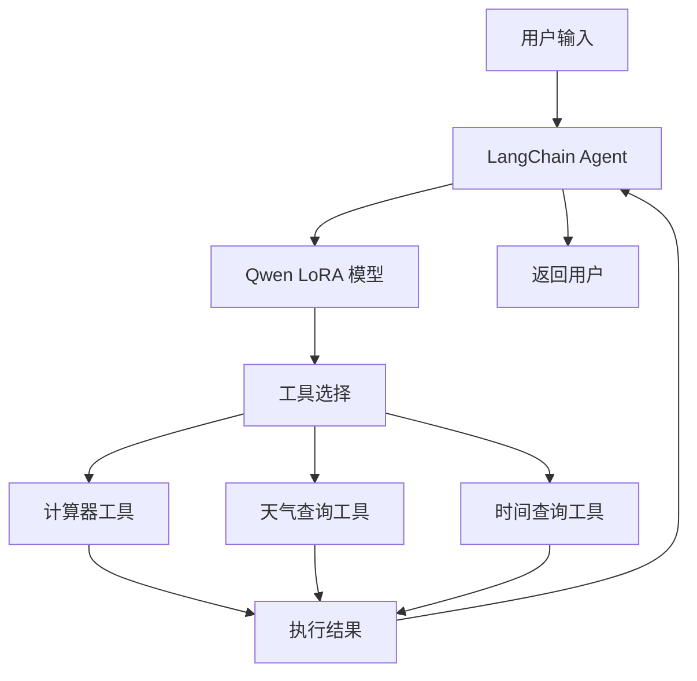

# Qwen3 FineTurning

一个基于 Qwen 大语言模型的学习项目，通过 LoRA 微调技术在医疗领域进行了专门优化，并集成了 Agent 工具调用和 RAG 检索增强生成功能。

## ✨ 功能特性

- **🔬 医疗领域微调**：使用 25K+ 条医疗对话数据进行 LoRA 微调，提升医疗领域问答能力
- **🛠️ Agent 工具调用**：集成 LangChain，支持计算器、天气查询、时间查询等工具
- **📚 RAG 知识库**：基于 ChromaDB 的向量数据库，支持检索增强生成
- **📊 基准测试**：使用 C-Eval 临床医学数据集进行模型评估
- **⚡ 高性能推理**：基于 vLLM 的推理服务，提供 OpenAI 兼容 API

## 📁 项目结构

```
Beauty/
├── agent/                      # Agent 相关功能
│   ├── agent.py               # LangChain Agent 实现（计算器、天气、时间工具）
│   ├── embedding.py           # 文本嵌入功能
│   ├── rag_query.py          # RAG 检索查询
│   └── serve_vllm.sh         # vLLM 服务启动脚本
├── benchmark/                 # 模型评测
│   └── benchmark_ceval.py    # C-Eval 临床医学评测脚本
├── data/                      # 训练和测试数据
│   ├── lora_identity.jsonl   # 身份定制数据（92条）
│   ├── lora_medical.jsonl    # 医疗领域数据（25K+条）
│   ├── lora_medical_merged.jsonl  # 合并后的训练数据
│   └── benchmark/            # C-Eval 评测数据集
├── eval/                      # 模型评估脚本
│   ├── eval_base.py          # 基础模型评估
│   ├── eval_lora.py          # LoRA 模型评估
│   └── eval_grpo.py          # GRPO 模型评估
├── trainer/                   # 训练脚本
│   └── train_lora.py         # LoRA 微调训练脚本
├── template/                  # 提示词模板
│   └── qwen_chat_template.jinja  # Qwen 聊天模板
├── model/                     # 模型存放目录
├── out/                       # 训练输出目录
├── run.py                     # 简单推理示例
├── requirements.txt           # 项目依赖
└── set_env.sh                # 环境变量配置
```

## 🚀 快速开始

### 环境要求

- 两张3090

### 安装依赖

```bash
# 克隆项目
cd Beauty

# 安装依赖
pip install -r requirements.txt
```

### 模型准备

下载 Qwen 基础模型并放置到 `model/qwen` 目录：

```bash
# 使用 HuggingFace CLI 下载（示例）
huggingface-cli download Qwen/Qwen3-4B-Instruct --local-dir model/qwen
```

## 💡 使用示例

### 1. 基础推理

使用基础模型进行简单的对话推理：

```bash
python run.py
```

### 2. LoRA 微调训练

在医疗领域数据上进行 LoRA 微调：

```bash
python trainer/train_lora.py
```

**训练配置**（可在脚本中修改）：
- 基础模型：`model/qwen`
- 训练数据：`data/lora_medical_merged.jsonl`
- 输出目录：`out/qwen3-4b-lora-medical`
- LoRA 参数：r=8, alpha=16, dropout=0.05
- 训练轮数：2 epochs
- 学习率：1e-4

训练过程支持：
- 自动划分训练/验证集（90%/10%）
- TensorBoard 日志记录
- 仅计算 assistant 回复的损失（`assistant_only_loss=True`）
- 自动保存最佳模型

查看训练日志：
```bash
tensorboard --logdir=out/qwen3-4b-lora-medical/logs
```

### 3. 模型评测

使用 C-Eval 临床医学数据集评测模型性能：

```bash
# 评测基础模型
python benchmark/benchmark_ceval.py  # MODEL_TYPE="base"

# 评测 LoRA 微调模型（修改脚本中的 MODEL_TYPE="lora"）
python benchmark/benchmark_ceval.py
```

评测结果将保存到 `out/benchmark/ceval-exma/clinical_medicine/` 目录。

### 4. Agent 工具调用

启动 vLLM 服务并使用 Agent 功能：

**步骤 1：启动 vLLM 服务**

```bash
# 修改 agent/serve_vllm.sh 配置后执行
bash agent/serve_vllm.sh
```

**步骤 2：运行 Agent**

```bash
# 交互式对话
python agent/agent.py

# 单次查询
python agent/agent.py --query "帮我计算 (12 + 8) * 3"
```

**支持的工具**：
- 🧮 **计算器**：执行数学运算
- 🌤️ **天气查询**：查询全球城市天气（需配置 `OPENWEATHER_API_KEY`）
- ⏰ **时间查询**：获取指定时区的当前时间

**示例查询**：
```
计算相关：
- 帮我计算 100 除以 4 再减去 5
- 2的10次方是多少？

天气相关：
- 北京现在天气怎么样？
- 上海明天天气如何？

时间相关：
- 现在几点了？
- 今天是什么日期？
```

### 5. RAG 检索增强生成

```bash
# 构建向量数据库
python agent/embedding.py

# 执行 RAG 查询
python agent/rag_query.py
```

## 📊 数据说明

### 训练数据

| 数据集 | 条数 | 用途 | 格式 |
|--------|------|------|------|
| `lora_identity.jsonl` | 92 | 身份定制 | 对话格式 |
| `lora_medical.jsonl` | 25,277 | 医疗领域微调 | 对话格式 |
| `lora_medical_merged.jsonl` | 25,369 | 合并训练数据 | 对话格式 |

数据格式示例：
```json
{
  "conversations": [
    {"role": "user", "content": "患者问题..."},
    {"role": "assistant", "content": "医生回答..."}
  ]
}
```

### 评测数据

- **C-Eval 临床医学**：中国临床医学考试单选题数据集
- 包含 dev 和 test 两个分割
- 用于评估模型在医疗领域的专业能力

## 🔧 配置说明

### 环境变量

创建 `.env` 文件或修改 `set_env.sh`：

```bash
# vLLM 服务地址
export VLLM_BASE_URL="http://localhost:8001/v1"

# OpenWeather API Key（用于天气查询）
export OPENWEATHER_API_KEY="your_api_key_here"

# 模型名称
export MODEL_NAME="lora-adapter"
```

### LoRA 训练参数调整

在 `trainer/train_lora.py` 中可调整以下参数：

```python
# 模型路径
MODEL_ID_OR_PATH = "model/qwen"
OUTPUT_DIR = "out/qwen3-4b-lora-medical"

# 数据配置
DATA_PATH = "data/lora_medical_merged.jsonl"
MAX_SEQ_LENGTH = 1024

# 训练超参数
NUM_EPOCHS = 2
PER_DEVICE_TRAIN_BATCH_SIZE = 8
GRADIENT_ACCUMULATION_STEPS = 8
LEARNING_RATE = 1e-4

# LoRA 配置
LORA_R = 8
LORA_ALPHA = 16
LORA_DROPOUT = 0.05
```

## 🔑 核心技术

### LoRA 微调

使用 PEFT（Parameter-Efficient Fine-Tuning）库实现 LoRA 微调：
- 目标模块：`q_proj`, `k_proj`, `v_proj`, `o_proj`, `gate_proj`, `up_proj`, `down_proj`
- 支持 bfloat16 混合精度训练
- 仅更新少量参数，显著降低训练成本

### Few-shot 评测

C-Eval 评测使用 Few-shot 策略：
- 使用 dev 集中的示例作为上下文
- 提示词采用中文格式
- 支持答案提取和准确率统计

### Agent 架构



## ⚠️ 注意事项

1. **GPU 显存要求**：
   - 两张3090可以顺利跑所有训练或者推理脚本

2. **天气 API 配置**：
   - 需要注册 [OpenWeatherMap](https://openweathermap.org/api) 获取免费 API Key
   - 将 API Key 设置为环境变量 `OPENWEATHER_API_KEY`

3. **模型路径**：
   - 确保 Qwen 模型正确放置在 `model/qwen` 目录
   - LoRA 适配器训练后保存在 `out/` 目录

4. **数据格式**：
   - 训练数据必须遵循 HuggingFace 对话格式
   - 字段名为 `conversations`，包含 `role` 和 `content`

5. **自定义聊天模板**：
   - 项目使用自定义的 Qwen 聊天模板（`template/qwen_chat_template.jinja`）
   - 支持 `` 标记用于 `assistant_only_loss`

## 📄 许可证

本项目仅供学习和研究使用。使用 Qwen 模型需遵守其相应的许可协议。

